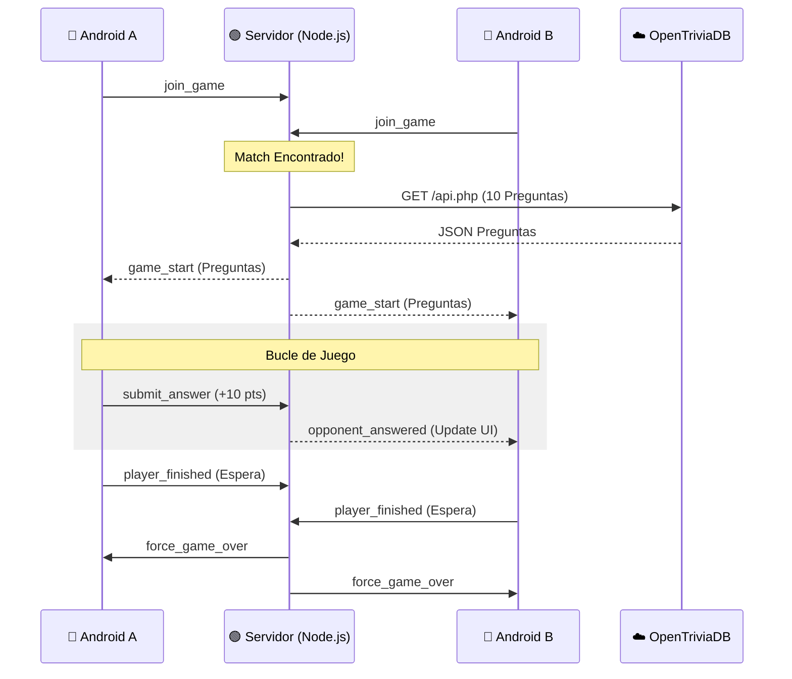

# 🧠 Trivia Multiplayer Real-Time

<div align="center">


**Un juego de preguntas y respuestas multijugador en tiempo real con sincronización exacta y efectos visuales**

[Características](#-características-principales) • [Capturas](#-capturas-de-pantalla) • [Arquitectura](#️-arquitectura-técnica) • [Instalación](#-instalación) • [Tecnologías](#-tecnologías-utilizadas)

</div>

---

## 📱 Descripción del Proyecto

Esta aplicación es una evolución de un juego de Trivia clásico, transformado en una experiencia **multijugador competitiva**. Utiliza una arquitectura Cliente-Servidor mediante **WebSockets** para conectar a dos jugadores, sincronizar las mismas preguntas desde una API externa y determinar un ganador en tiempo real.

### ✨ Características Principales

- **⚡ Conexión en Tiempo Real:** Comunicación bidireccional instantánea usando `Socket.io`
- **⚔️ Modo Versus:** Marcador en vivo que muestra el progreso del oponente
- **🌍 Preguntas Infinitas:** Integración con la **OpenTriviaDB API** para obtener preguntas aleatorias en cada partida
- **⚖️ Fair Play:** El servidor gestiona las preguntas y valida las respuestas para evitar trampas
- **🎉 Feedback Visual:** Sistema de partículas (**Konfetti**) para celebrar la victoria o lamentar la derrota
- **🔄 Sincronización Final:** Sala de espera al terminar para asegurar que ambos jugadores ven el resultado al mismo tiempo

---

## 📸 Capturas de Pantalla

<div align="center">

| Buscando Rival | Gameplay (Versus) | Victoria (Confeti) |
|:---:|:---:|:---:|
|  |  |  |
| *Estado de espera y conexión* | *Marcador rival en tiempo real* | *Animación de partículas* |

</div>

> **Nota:** Reemplaza las rutas de imagen con tus propias capturas de pantalla

---

## 🛠️ Arquitectura Técnica

El sistema utiliza una arquitectura de estrella donde el servidor actúa como árbitro central:



### Componentes Clave

#### 📱 Cliente Android (Java)
- Interfaz de usuario nativa para Android
- Gestión de eventos Socket.io
- Renderizado de preguntas y respuestas
- Sistema de animaciones con Konfetti

#### 🟢 Servidor Node.js
- Gestión de salas y matchmaking
- Sincronización de estado de juego
- Validación de respuestas
- Integración con OpenTriviaDB API

#### ☁️ OpenTriviaDB API
- Proveedor de preguntas aleatorias
- Múltiples categorías y dificultades
- Formato estandarizado JSON

---

## 🚀 Instalación

### Requisitos Previos

- **Android Studio** (última versión recomendada)
- **Node.js** v14+ y npm
- **JDK** 8+
- Dispositivo Android o emulador con API 21+

### Configuración del Servidor

```bash
# Navegar al directorio del servidor
cd servidor

# Instalar dependencias
npm install

# Iniciar el servidor
npm start
```

El servidor estará disponible en `http://localhost:3000`

### Configuración del Cliente Android

1. Abre el proyecto en Android Studio
2. Configura la URL del servidor en el archivo de configuración
3. Sincroniza las dependencias de Gradle
4. Ejecuta la aplicación en tu dispositivo o emulador

---

## 🔧 Tecnologías Utilizadas

### Frontend (Android)
- **Java** - Lenguaje principal
- **Socket.io Client** - Comunicación en tiempo real
- **Konfetti** - Sistema de partículas para efectos visuales
- **Gson** - Parsing JSON

### Backend (Node.js)
- **Express.js** - Framework web
- **Socket.io** - WebSockets bidireccionales
- **Axios** - Cliente HTTP para API externa
- **OpenTriviaDB API** - Fuente de preguntas

---

## 📋 Funcionalidades del Juego

### Sistema de Matchmaking
- Cola de espera automática
- Emparejamiento instantáneo cuando hay 2 jugadores
- Notificación de conexión/desconexión del oponente

### Mecánica de Juego
- 10 preguntas por partida
- Sistema de puntuación en tiempo real
- Sincronización de progreso entre jugadores
- Validación server-side de respuestas

### Sistema de Resultados
- Pantalla de espera hasta que ambos jugadores terminen
- Declaración de ganador con efectos visuales
- Opción de reiniciar y buscar nueva partida

---

## 🎮 Flujo de Juego

1. **Lobby:** El jugador entra y espera a un oponente
2. **Inicio:** El servidor envía las mismas 10 preguntas a ambos jugadores
3. **Competición:** Cada respuesta actualiza el marcador visible para el oponente
4. **Finalización:** Al terminar, se espera al otro jugador
5. **Resultado:** Pantalla final con ganador y efectos visuales
6. **Reinicio:** Opción para volver a jugar

---

## 🤝 Contribuciones

Las contribuciones son bienvenidas. Si deseas mejorar el proyecto:

1. Haz un Fork del repositorio
2. Crea una rama para tu feature (`git checkout -b feature/nueva-funcionalidad`)
3. Commit tus cambios (`git commit -m 'Añadir nueva funcionalidad'`)
4. Push a la rama (`git push origin feature/nueva-funcionalidad`)
5. Abre un Pull Request

---

## 📄 Licencia

Este proyecto está bajo la Licencia MIT. Consulta el archivo `LICENSE` para más detalles.

---

## 📧 Contacto

¿Tienes preguntas o sugerencias? No dudes en abrir un issue o contactarme directamente.

---

<div align="center">

**⭐ Si te gusta este proyecto, dale una estrella en GitHub ⭐**

Hecho con ❤️ y ☕

</div>
